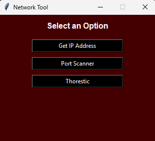
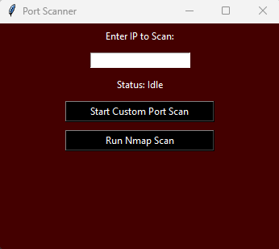
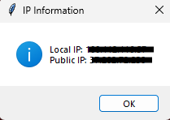

# IP-TOOL — Network Tool 🖥️🌐

[](https://www.python.org/)
[](#)
[](https://docs.python.org/3/library/tkinter.html)
[](LICENSE)


A simple **Windows desktop GUI** tool built with **Python + Tkinter** to:
- 🔎 Show **Local IP** + **Public IP**
- 🚪 Run a **Custom Port Scan** (ports `1 → 1024`)
- 🛰️ Run an **Nmap scan** (optional)
- 🧾 Save results automatically to `logs/scan_log.txt`

---

## ✨ Features

- ✅ Local IP / Public IP lookup
- ✅ Custom TCP port scan (`1-1024`)
- ✅ Nmap scan support (`-Pn -sT -sV`)
- ✅ Auto logging to file
- ✅ Simple GUI + status text while scanning
- ✅ Uses threads so the UI doesn’t freeze

---

## 📸 Screenshots

### Main Menu


### Port Scanner


### IP Information


---

## 📁 Project Structure

```

IP-TOOL/
│── IP_lookup.py
│── run.bat
│── requirements.txt
│── logs/              (auto-created)
│── .venv/             (auto-created by run.bat)

````

---

## 🧰 Requirements

- **Python 3.9+**
- `requests` (installed automatically by `run.bat`)
- (Optional) **Nmap for Windows** for the Nmap scan button

---

## ⚙️ Installation

### 1) Clone
```bash
git clone https://github.com/thorestic/IP-Tool.git
cd IP-TOOL
````

### 2) Install dependencies (optional manual way)

```bash
pip install -r requirements.txt
```

> Recommended: use `run.bat` and it will do everything.

---

## ▶️ Run

### ✅ Option A (Recommended) — `run.bat`

Double-click:

* `run.bat`

It will:

* Create `.venv` if missing
* Install/update dependencies
* Run the app

### ✅ Option B — Manual

```bash
python IP_lookup.py
```

---

## 🧪 How to Use

### 🔎 Get IP Address

Click **Get IP Address** to view:

* **Local IP** (LAN)
* **Public IP** (WAN) via `https://api.ipify.org`

### 🚪 Custom Port Scanner

1. Click **Port Scanner**
2. Enter an IP (example: `192.168.1.1`)
3. Click **Start Custom Port Scan**
4. Output is saved to:

   * `logs/scan_log.txt`

### 🛰️ Nmap Scan (Optional)

1. Click **Port Scanner**
2. Enter an IP
3. Click **Run Nmap Scan**

The app tries to auto-detect:

* `C:\Program Files\Nmap\nmap.exe`
* `C:\Program Files (x86)\Nmap\nmap.exe`

If not found, it prompts you to select `nmap.exe`.

---

## 🧾 Logs

All results are appended to:

```
logs/scan_log.txt
```

Contains:

* Timestamp
* Open ports found (custom scan)
* Full Nmap output (nmap scan)
* Scan duration

---

## 🚀 Releases

## ⬇️ Download (Windows EXE)
Download the latest release from:
https://github.com/thorestic/IP-Tool/releases/tag/ip

## 👨‍💻 For Developers
Clone the repo and run:

```bash
pip install -r requirements.txt
python IP_lookup.py
```

## 🛠 Troubleshooting

### `No module named 'requests'`

Run:

```bash
pip install requests
```

(or use `run.bat`)

### Nmap not found

Install Nmap for Windows then re-run.
If still not found, select `nmap.exe` when prompted.

### Public IP lookup fails

Check your internet connection (uses `api.ipify.org`).

---

## ⚠️ Disclaimer

Use scanning features only on networks/systems you **own** or have **explicit permission** to test.

---

## 🧾 License

MIT License — you can change this if you want.

---

## © Credit

**All rights reserved to Thorestic.©**


